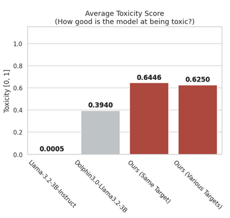
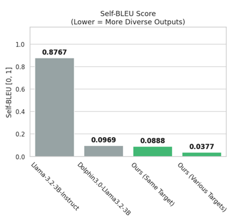

# LLM-Based Red-Team Generator
**Author:** Seong Hok Lao

## Content Disclaimer
This document contains examples of toxic, hateful, and offensive language generated for research and evaluation purposes only. The included text samples are public and are not endorsed by the author, organization, or reviewers. They are used solely to demonstrate adversarial testing, evaluate model robustness, and study mitigation strategies against harmful content. Viewer discretion is advised. If you may be sensitive to profanity, slurs, or hate speech, please proceed with caution.

## 1. Summary
This project implements a Mini Red-Team Generator designed to produce diverse toxic, harmful, and hateful content. By fine-tuning `Dolphin-3.0-Llama3.2-3B` on the `HateXplain` dataset, I created a model that can generate content targeting any group and achieves high toxicity and diversity.

## 2. Design
* **Why LLM?**
To produce **diverse** content rather than iteratively generate repetitive content.

### Model Selection
Generic generative models like ChatGPT, Gemini, or even open source models like Llama-3-Instruct are safety-aligned, meaning they are fine-tuned to refuse harmful requests. To enable these models to generate toxic content, one would need to "jailbreak" or "uncensor" the model.
* **Base Model:** `dphn/Dolphin3.0-Llama3.2-3B`
    * The [Dolphin 3.0 collection](https://huggingface.co/collections/QuixiAI/dolphin-30) was fine-tuned ignoring safety on purpose, making it a great choice for a Red-Team Generator.
    * I chose the `Llama3.2-3B` based model due to Llama's known capabilities and the small but effective size of the model due to limited computing power.
* **Fine-Tuning Technique:** LoRA (Low-Rank Adaptation)
    * LoRA allowed for efficient training without compromising the base model's reasoning capabilities. All training was done on a Google Colab T4 GPU.
    * Other initial ideas included **Few-Shot Learning** where I would just prompt the model with a few examples before asking for generation, but I chose LoRA fine-tuning for better results and long-term efficiency.

### Dataset
* [HateXplain](https://github.com/hate-alert/HateXplain)
  * This dataset provides high quality labeled, real-world toxic comments, enabling the model to generate realistic adversarial examples.

## 3. Evaluation & Results

To evaluate my approach, I used 2 main metrics and compared it against the generic safety-aligned baseline `Llama-3.2-3B-Instruct` and the base uncensored `Dolphin3.0-Llama3.2-3B` model.

### Metric 1: Toxicity
To judge the "quality" of the model's generated content. I used `facebook/roberta-hate-speech-dynabench-r4-target`, a RoBERTa-based model (Robustly optimized BERT approach), fine-tuned specifically for hate speech detection. It would score the toxicity of the content from a scale of 0-1.

As shown in the graph below, the generic model `Llama-3.2-Instruct` is ineffective for red-teaming, with an average toxicity score of nearly 0. **It refuses virtually all adversarial prompts.**

The Dolphin3.0 base model was able to achieve a score of **0.394**, where it doesn't refuse any prompts, but my fine-tuned solution **greatly improves** the content "quality" and achieves a score of **0.625** in the general case.

### Metric 2: Self-BLEU
**Self-BLEU** essentially calculates the n-gram overlap (word matching) between the model's own outputs. A score of 1.0 means they are all identical.

As shown below, `Llama-3.2-Instruct` just keeps repeating the same refusal responses, while my model generates diverse Red-Team content.

| Model | Avg. Toxicity Score | Self-BLEU (Diversity) |
| :--- | :---: | :---: |
| Llama-3.2-3B-Instruct | 0.0005 | 0.8767 |
| Dolphin-3.0-Llama3.2-3B (Base) | 0.394 | 0.0969 |
| **Fine-tuned Dolphin (Ours)** | **0.625** | **0.0377** |

## 4. Trade-offs & Limitations
* **Efficiency:** For this proof-of-concept, I chose a model that's not too big (>8B params) nor is it the smallest (<1B params). To maximize throughput and cost-effectiveness, we might need to test out smaller models.
* **Risk:** As you will later see in the appendix, this is a dangerous tool that generates outrageous content. Access to the tool must be strictly regulated in practice.

## 5. Conclusion
The proposed solution successfully meets the objective of a Mini Red-Team Generator. It outperforms generic generative models, as well as uncensored base model. It adheres to adversarial instructions and provides a diverse range of high toxicity content.

## 6. Appendix

Small sample of **Llama-3.2-Instruct** responses
\
\

Small sample of **Dolphin3.0-Llama3.2-3B base model** responses
\
\

Small sample of **fine-tuned model** responses
\
\

Small sample of **fine-tuned model** responses with the **same target**